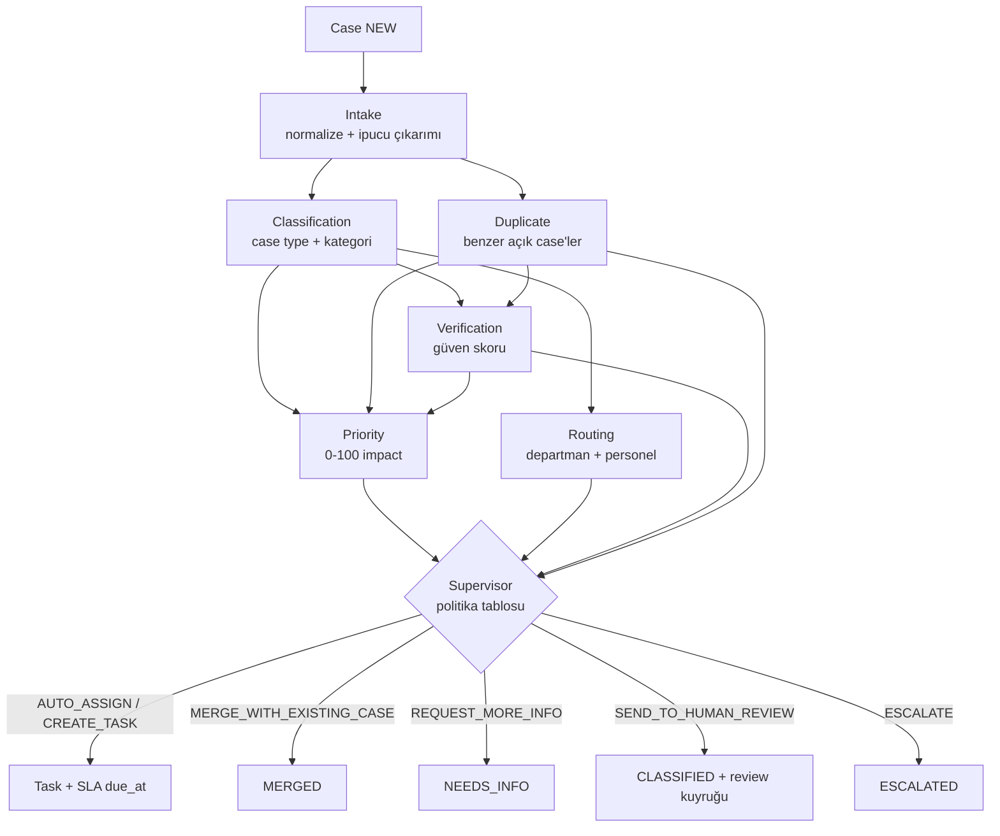

# AGENTS — Ücretsiz, Yerel ve Açıklanabilir Agent Mimarisi

## 1. Temel Karar: Ücretli API Yok

Agent'lar **hiçbir ücretli LLM API'sine bağımlı değildir** (OpenAI/Claude/Gemini API yok). Üç katmanlı
yerel bir "zekâ yığını" kullanılır:

| Katman | Teknoloji | Maliyet | Nerede kullanılır | Her zaman açık mı? |
|---|---|---|---|---|
| **K1 – Kural motoru** | Python, regex, Türkçe sözlükler, ağırlıklı puanlama | 0 | Intake, Priority, Verification, Routing, Supervisor, Monitoring, Resolution | ✅ Evet (fallback) |
| **K2 – Kendi eğittiğimiz ML** | scikit-learn: TF-IDF (karakter n-gram) + Logistic Regression; opsiyonel çok dilli embedding (`paraphrase-multilingual-MiniLM-L12-v2`, CPU'da çalışır) | 0 | Classification, Duplicate | ✅ Evet (model dosyası repoda/artefakt olarak) |
| **K3 – Yerel LLM (opsiyonel)** | Ollama + küçük açık model (ör. `qwen2.5:3b`, `llama3.2:3b`) | 0 (kendi bilgisayarımızda) | Analytics özetinin dilini güzelleştirme, Intake'te belirsiz metinden varlık çıkarımı | ❌ Kapalı olabilir; sistem K1/K2 ile tam çalışır |

`.env`: `AI_MODE=rules|ml|ml_llm` (varsayılan `ml`), `LLM_PROVIDER=none|ollama`, `OLLAMA_URL`.

### Neden bu yaklaşım akademik olarak daha güçlü?

1. **Ölçülebilirlik:** Kendi modelimizi eğittiğimiz için train/test ayrımı, confusion matrix, macro-F1
   raporlayabiliriz (RQ1). Hazır API'de "neden doğru/yanlış?" sorusunun cevabı yok.
2. **Açıklanabilirlik:** Logistic Regression'da her kararı en çok etkileyen n-gram'lar gösterilebilir;
   Priority'de her sinyalin puana katkısı tablo olarak verilir.
3. **Determinizm & test:** Aynı girdi → aynı çıktı. pytest ile doğrulanabilir.
4. **Sürdürülebilirlik:** İnternet/API kesintisinde sistem çökmez; KVKK açısından veri kampüs dışına çıkmaz.
5. **İnsan-AI döngüsü:** Manager düzeltmeleri (`decision_feedback`) yeni etiketli veri olur → model
   yeniden eğitilir → versiyon karşılaştırması yapılır (öğrenen organizasyon, YBS boyutu).

> **Savunma notu:** "LLM kullanmıyorsanız bu agent mı?" — Evet. Russell & Norvig tanımıyla agent;
> ortamı algılayan (structured input), bir politika/model ile karar veren ve eylem öneren sistemdir.
> Sistemimizde her agent algı → karar → gerekçe → eylem önerisi döngüsüne sahiptir; orchestrator ve
> autonomy policy ile çok-agent'lı bir karar destek mimarisi oluşur.

## 2. Ortak Agent Sözleşmesi

> **Uygulama durumu:** sözleşme `backend/app/agents/base.py` (✅ E5-1), Türkçe normalizasyon
> `backend/app/agents/text.py` ve Intake Agent `backend/app/agents/intake.py` (✅ E5-2). Model eğitimi (`ai/`)
> **aynı** `normalize()` fonksiyonunu kullanır: `ai/training/normalization.py` backend'deki fonksiyonu doğrudan
> yükler, model onu adıyla saklar (✅ E5-3). Normalizasyon değişirse model yeniden eğitilir.

```python
class AgentResult(BaseModel, Generic[TOut]):
    agent_name: str
    decision: str                 # kısa karar kodu
    confidence: float | None      # 0..1
    reasons: list[Reason]         # [{code, message_tr, weight, evidence}]
    output: TOut                  # agent'a özgü Pydantic çıktı
    model: str                    # "rules@1.0", "tfidf-logreg@2026.10.1"
    latency_ms: int

class BaseAgent(Protocol[TIn, TOut]):
    name: ClassVar[str]
    version: ClassVar[str]
    def run(self, inp: TIn, ctx: AgentContext) -> AgentResult[TOut]: ...
```

- `AgentContext`: sadece okunur veriler (case type sözlüğü, lokasyon listesi, aday benzer case'ler,
  aktif policy'ler, şimdiki zaman). Agent **DB'ye erişmez**; context'i servis katmanı hazırlar.
- Her agent çıktısı `agent_decisions` tablosuna `input_snapshot` ile birlikte yazılır → karar tekrar üretilebilir.
- Provider arayüzleri (`agents/providers/`): `TextClassifier`, `Embedder`, `LLMClient` Protocol'leri.
  Model yüklenemezse otomatik olarak bir alt katmana düşülür (ML → kural) ve `reasons` içine
  `FALLBACK_USED` eklenir.

## 3. Pipeline (Orchestrator)



Orchestrator sıralı ve basittir (Python fonksiyonları). LangChain/LangGraph kullanılmaz.

✅ **Uygulandı (E5-8b):** `backend/app/services/analysis_service.py`.
- `POST /cases` yanıtı `ANALYZING` döner; hat yanıttan sonra (`BackgroundTasks`, kendi DB oturumuyla) çalışır:
  Intake → Classification → Duplicate → Verification → Priority → Routing → Supervisor. Duplicate
  Classification'dan sonra çalışır (tür eşleşmesi skorun parçası). Her karar aynı `run_id` ile
  `agent_decisions`'a yazılır.
- Kararın uygulanması: `AUTO_ASSIGN`/`CREATE_TASK` → `CLASSIFIED` (AI_CLASSIFIED) + `ROUTED` + görev ve SLA
  (`TaskOpener`, manager atamasıyla ortak) → `ASSIGNED`; `ESCALATE` → `ESCALATED`; `SEND_TO_HUMAN_REVIEW` →
  `CLASSIFIED` + `needs_human_review`; `REJECT_OUT_OF_SCOPE` → `REJECTED`; `REQUEST_MORE_INFO` → `NEEDS_INFO`
  (soru `info_request`'e yazılır); `MERGE_WITH_EXISTING_CASE` → `MERGED` (ana bildirime bağlanır, görev
  açılmaz). Her koşu `SUPERVISOR_DECIDED` olayı bırakır.
- Bildirim yapan ek bilgi verince (`POST /cases/{id}/info`) hat yeniden çalışır; yanıt açıklamaya eklenir.
  Agent aynı bildirim için **bir kez** soru sorar; ikinci kez anlaşılmazsa manager'a gider (sonsuz soru döngüsü yok).
- Bildirim bu arada `ANALYZING` dışına çıktıysa (manager el koydu) hat hiçbir şey yapmaz.
- Fotoğraf bildirimden sonra ayrı istekle yüklendiği için analiz anında `has_photo=false` (Verification'ın
  fotoğraf sinyali ileride yeniden analizle kullanılacak). L2 "manager'a bildirim" henüz yalnız kararda
  (`notify_manager`); bildirim tablosu FAZ 6.
- **Acil durum anahtarı:** `AGENTS_ENABLED=false` → hat çalışmaz, bildirim manager'ı bekler (FAZ 4 davranışı).
- Kararlar: `GET /cases/{id}/decisions` (MANAGER, ADMIN).

## 4. Agent'lar

### 4.1 Intake Agent (K1, opsiyonel K3)
- **Girdi:** title, description, seçilen location_id, fotoğraf var mı
- **İşlem:** Türkçe normalizasyon (`İ/ı` doğru lowercase, ASCII-katlama: "sabun yok" = "sabun yok",
  "tuvalet"≈"wc"≈"lavabo" eşanlam sözlüğü), yazım hatası toleransı (`rapidfuzz`),
  regex ile lokasyon ipuçları (`B blok`, `2. kat`, `Z-12`, `erkek/kadın wc`),
  aciliyet sözlüğü (`acil, kıvılcım, duman, yanık kokusu, su basıyor, elektrik çarptı, yangın`).
- **Çıktı (v1.0):** `normalized_text, urgency_hints[], location_hints[], location_consistency, is_meaningful, has_photo`.
  `problem_phrase` / `entities` ve yazım hatası toleransı (`rapidfuzz`) ileride; karakter n-gram modeli ekli ve
  hatalı yazımları zaten tolere eder.
- Seçilen lokasyon ile metindeki lokasyon ipucu çelişiyorsa `location_consistency=false` (Verification sinyali).
  Kontrol: metindeki bina harfi (`b blok`) ve oda kodu (`a101`/`a-101`) seçilen lokasyonun yolunda var mı; ipucu
  yoksa `null`. Eş anlamlılar yalnız **tam kelime** eşlenir (`wc`/`lavabo` → `tuvalet`).

### 4.2 Classification Agent (K2 + K1)
- **Model:** `TfidfVectorizer(analyzer="char_wb", ngram_range=(2,5))` ∪ kelime (1,2)-gram →
  `LogisticRegression(class_weight="balanced")` + `CalibratedClassifierCV` (güvenilir olasılık).
  Karakter n-gram, Türkçe eklemeli yapıya ("sabunluk", "sabunu", "sabunlar") lemmatizer olmadan dayanıklıdır.
- **Kural katmanı:** Güvenlik sözlüğü eşleşirse (kıvılcım, yangın…) model sonucu ne olursa olsun
  `ELECTRICAL_FAILURE`/`SECURITY_INCIDENT` adayına yükseltilir ve gerekçeye `SAFETY_RULE` eklenir.
- **Kapsam dışı:** idari hizmet talepleri (transkript, kayıt, maaş) `OUT_OF_SCOPE` sınıfına düşer; görev
  oluşturulmaz, kullanıcıya ilgili birim gösterilir ([DEPARTMENTS.md](DEPARTMENTS.md) bölüm 1).
- **Çıktı:** `case_type_code, category, confidence, top_k[{code, prob}], explanation.top_features[]`
- **Karar eşiği:** `confidence < policy.min_confidence_auto` → human review.
- Model dosyası yoksa: anahtar kelime puanlaması (case_types.keywords) → `model="rules@1.0"`.
- ✅ **Uygulandı (E5-4):** `backend/app/agents/classification.py` + `model_store.py`.
  - Model `backend/ml_models/classifier/v1/` (ai'de `--publish` ile kopyalanır, ~4 MB sıkıştırılmış).
  - Yüklenmezse (dosya yok **ya da** scikit-learn sürümü `metrics.json`'dakinden farklı) kural tabanına
    düşülür. Farklı sürümle kaydedilmiş pickle sessizce yanlış sonuç verebilir; bu yüzden hiç yüklenmez.
    Backend ve ai aynı sürümü sabitler (`scikit-learn==1.9.1`).
  - Yalnız girdideki (kurumun aktif) türler arasından seçilir. Güvenlik kuralı (`SAFETY_RULES`: kıvılcım,
    elektrik çarptı, yanık kokusu → ELECTRICAL_FAILURE; yangın, duman, patlama, gaz kokusu →
    SECURITY_INCIDENT; su basıyor → WATER_LEAK) model zaten güvenlik türü seçmediyse kararı değiştirir.
  - Çıktı: `case_type_code, category, top_k (3), matched_keywords, safety_override`; gerekçe kodları
    `MODEL_PREDICTION | RULE_MATCH | NO_KEYWORD_MATCH | SAFETY_RULE`.
  - Henüz bildirim akışına bağlı değil: Supervisor ve orchestrator ile birlikte bağlanacak (E5-8).

### 4.3 Duplicate Agent (K2 + K1)
1. **Aday üretimi (servis):** aynı organizasyon, terminal olmayan, son 24 saat, aynı bina (path prefix).
2. **Skor:** `dup = 0.45·text_sim + 0.25·type_match + 0.20·location_score + 0.10·time_decay`
   - `text_sim`: TF-IDF kosinüs (varsayılan) veya yerel embedding kosinüs (opsiyonel)
   - `location_score`: aynı alan 1.0, aynı kat 0.6, aynı bina 0.3
   - `time_decay = exp(-Δdakika / τ)`, τ case type'a göre (sabun: 120 dk, su kaçağı: 60 dk)
- **Eşikler (config):** ≥ 0.80 → `MERGE` önerisi; 0.60–0.80 → olası duplicate, human review; < 0.60 → yeni case.
- **Çıktı:** `duplicate_probability, possible_parent_case_id, similar_cases[{case_id, score, components}]`

✅ **Uygulandı (E5-6):** `backend/app/agents/duplicate.py`; adaylar `analysis_repository.duplicate_candidates`.
- **Adaylar:** sorunu hâlâ açık ve sınıflandırılmış bildirimler (`CLASSIFIED, ESCALATED, ASSIGNED, ACCEPTED,
  IN_PROGRESS, REOPENED`). Çözülmüş bildirimden sonra gelen bildirim sorunun tekrarladığını gösterir, ayrı tutulur.
- **text_sim:** karakter 3-5 gram **TF** kosinüs (IDF yok), metinler Türkçe normalize edilir. Aday kümesi 2-10
  metin olduğundan IDF tam da benzerliği gösteren ortak kelimeleri cezalandırıyordu (aynı sorunun farklı
  yazımları 0,27-0,50'de kalıyordu; TF ile 0,42-0,63).
- **Konum:** kat, yer kattan derinse vardır (`KMP/A/A-1/A-1-WCE` → kat `A-1`); doğrudan binaya bağlı yerler
  (yemekhane salonu) aynı bina sayılır. τ: varsayılan 120 dk, `WATER_LEAK` 60 dk.
- **Ölçülen örnekler** (aynı WC, aynı anda): "Sabun bitmiş" → 0,83 birleştir; "Erkek tuvaletinde sabun yok" →
  0,74 manager incelesin; aynı yerde "çöp kutusu dolmuş" → 0,44 yeni bildirim. Tür eşleşmesi ayrımı taşır;
  metin tek başına zayıf ("klima çalışmıyor" / "projeksiyon çalışmıyor" metin benzerliği 0,58).
- `duplicate_count` (Verification ve Priority sinyali) = eşik (0,60) üstündeki her benzer bildirim + ona daha
  önce bağlananlar. Karar kodları `DUPLICATE | POSSIBLE_DUPLICATE | NEW_CASE`; eşikler Supervisor ile ortak.
- **Birleştirme** (`services/merge.py`, agent ve manager ortak): bildirim `MERGED`, `parent_case_id` dolar, ana
  bildirimin `duplicate_count`'u artar, iki bildirime de `CASE_MERGED` olayı. Manager olası tekrarı
  `POST /cases/{id}/merge` ile bağlar; karar `decision_feedback`'e (`field=duplicate`) yazılır.
- İleride: ana bildirimin önceliği yeni bildirimlerle yeniden hesaplanmıyor (öncelik ilk analizde sabit);
  bağlanan bildirim sahiplerine ana bildirim kapanınca haber verilmesi bildirim tablosuyla (FAZ 6) gelir.

### 4.4 Verification Agent (K1)
Ağırlıklı skor (0..1), her sinyal gerekçeye yazılır:

| Sinyal | Etki |
|---|---|
| Fotoğraf var | +0.20 |
| Duplicate/benzer bildirim sayısı (≥1 / ≥3) | +0.15 / +0.25 |
| Lokasyon tutarlı | +0.15, çelişkili −0.15 |
| Reporter geçmişi (reddedilen case oranı düşük) | +0.10 … −0.20 |
| Aynı lokasyon+tipte geçmişte doğrulanmış case | +0.10 |
| Metin çok kısa / anlamsız | −0.20 |

Başlangıç 0.40. `verification_level`: LOW (<0.4) / MEDIUM / HIGH (≥0.7).

✅ **Uygulandı (E5-7):** `backend/app/agents/verification.py`. Bildirim yapanın geçmişi: en az 3 bildirimi
varsa değerlendirilir; reddedilen oranı ≤ %10 → +0.10, ≥ %50 → −0.20, arası etkisiz. Skor [0, 1]
aralığına kırpılır ve 2 ondalığa yuvarlanır. Sayılar (tekrar, geçmiş) girdi olarak gelir; agent DB'ye dokunmaz.

### 4.5 Priority Agent (K1)
`impact_score = clamp(Σ sinyal katkıları, 0, 100)`:

| Sinyal | Katkı aralığı |
|---|---|
| case_type.base_severity | 0–40 |
| Güvenlik ilgisi (is_safety_related / güvenlik kelimesi) | +30 (ve min. 85'e taban) |
| Lokasyon önemi (importance_weight) | 0–15 |
| Duplicate bildirim sayısı | 0–10 |
| Zaman hassasiyeti (ders saati, sınav haftası) | 0–5 |
| Tekrarlama (son 30 gün aynı lokasyon+tip) | 0–10 |
| Aciliyet ifadeleri | 0–10 |

Bantlar: LOW 0–39 · MEDIUM 40–64 · HIGH 65–84 · CRITICAL 85–100.
UI'da her katkı bir bar olarak gösterilir ("neden HIGH?").

✅ **Uygulandı (E5-5):** `backend/app/agents/priority.py`. Tablodaki katkılara ek iki **taban**:
- **Türün başlangıç önceliği** (seed `priority`): skor o bandın altına inmez (asansör arızası en az HIGH).
  Yalnız formülle asansör ~40 (MEDIUM) çıkıyordu; seed'deki birim önceliğiyle çelişmesin diye.
- **Metinde güvenlik ifadesi** (Intake aciliyet ipucu / Classification `SAFETY_RULE`): en az 85 (CRITICAL).
  Türün kendisinin güvenlikle ilgili olması (`is_safety_related`) yalnız +30 verir, tabana çekmez.

Ders saati: hafta içi 08:00–18:00 Türkiye saati (sabit UTC+3) → +5. Sınav haftası takvimi henüz yok.
Yarım puanlar yukarı yuvarlanır (lokasyon 70 → 10,5 → 11). Örnekler: tek "sabun bitti" (WC, ders saati)
→ 22 LOW; aynı sabun 5 kişi daha bildirmiş + son 30 günde 4 benzer → 40 MEDIUM; elektrik arızası → ~73 HIGH;
"prizden kıvılcım çıkıyor" → ≥ 85 CRITICAL.

### 4.6 Routing Agent (K1)
1. Departman: `case_types.default_department_id` (birincil; görevi alır). `case_types.secondary_department_id`
   varsa o birim yalnız bilgilendirilir (ör. su taşkını: Bakım Onarım + Destek Hizmetleri). Eşleşme
   [DEPARTMENTS.md](DEPARTMENTS.md) bölüm 3'teki tablodur; `OUT_OF_SCOPE` için departman yoktur.
2. Personel: departmandaki aktif STAFF arasından
   `skor = −açık_task_sayısı·w1 − (farklı_bina ? w2 : 0) + son_30g_aynı_tip_tecrübe·w3` en yüksek olan.
3. Uygun personel yoksa `assigned_user_id=NULL` → departman havuzu + Supervisor'a sinyal.

✅ **Uygulandı (E5-7):** `backend/app/agents/routing.py`. Ağırlıklar (varsayım, gerçek veriyle ayarlanacak):
w1 = 1 (açık görev başına), w2 = 0,5 (başka binada; aktif görevi yoksa binası bilinmez, ceza yok),
w3 = 0,2 (son 30 günde aynı türde iş başına, en fazla 5 iş → tecrübe en fazla 1 görevlik yükü dengeler).
5 ve üstü açık görevi olan personel aday değildir. Eşitlikte küçük kullanıcı id'si. Kararlar:
`ASSIGN_STAFF | ROUTE_TO_POOL | NO_DEPARTMENT`; gerekçede en iyi 3 aday ve puanları.

### 4.7 Supervisor Agent (K1 — deterministik karar tablosu)
Sırayla değerlendirilir, ilk eşleşen kural kazanır:

| # | Koşul | Karar |
|---|---|---|
| 1 | Metin geçersiz/boş veya verification < 0.2 | `REQUEST_MORE_INFO` |
| 2 | duplicate_probability ≥ 0.80 | `MERGE_WITH_EXISTING_CASE` |
| 3 | Policy L3 **veya** priority = CRITICAL **veya** güvenlik kuralı | `ESCALATE` |
| 4 | Tür `OUT_OF_SCOPE` (idari talep: transkript, maaş…) | `REJECT_OUT_OF_SCOPE` |
| 5 | classification confidence < min_confidence_auto (bilinmiyorsa da) **veya** 0.60 ≤ dup < 0.80 **veya** Routing birim bulamadı (OTHER) | `SEND_TO_HUMAN_REVIEW` |
| 6 | Routing personel buldu | `AUTO_ASSIGN` (L2 ise manager'a bildirim) |
| 7 | Personel yok | `CREATE_TASK` (departman havuzu; L2 ise manager'a bildirim) |

✅ **Uygulandı (E5-8a):** `backend/app/agents/supervisor.py` (saf karar tablosu; uygulamayı orchestrator
yapar). Sınırlar güvenli tarafa aittir: doğrulama tam 0.20 yeterli, güven tam `min_confidence_auto` yeterli,
benzerlik 0.60'ın altı yok sayılır. `ESCALATE` ve `SEND_TO_HUMAN_REVIEW` → `needs_human_review`.
Kural 4 spec'e eklendi (kapsam dışı taleplerin gidecek birimi yok). `safety_term` Classification çıktısından
gelir: model zaten güvenlik türü seçtiyse karar değişmez ama ifade yine raporlanır.
Politika: `agent_policies` (tür başına bir satır, seed'den; `min_confidence_auto` varsayılanı 0.70).

Çıktı gerekçesi, tetiklenen kuralı ve diğer agent'ların hangi değerlerinin kullanıldığını içerir.

> `ESCALATE` de bir agent kararıdır; `agent_decisions`'a yazılır ve Automation Rate hesabında
> "doğru şekilde insana devredildi" olarak ayrıca raporlanır.

### 4.8 Monitoring Agent (K1, 5 dk'da bir)
| Kontrol | Eylem |
|---|---|
| Geçen süre ≥ SLA'nın %75'i | `SLA_WARNING` (bir kez) + atanan staff'a bildirim |
| `due_at` geçti | `SLA_BREACHED` + manager bildirimi + `escalation_level += 1` |
| ASSIGNED ama `response_due_at` geçti (kabul yok) | `REASSIGN_RECOMMENDATION` (başka personel önerisi) |
| ANALYZING > 5 dk | pipeline yeniden çalıştırılır |
| NEEDS_INFO > 48 sa | REJECTED |

İdempotent: aynı uyarı aynı case için bir kez üretilir (event varlığı kontrolü).

### 4.9 Resolution Agent (K1)
Girdi: completion_note, kanıt fotoğrafı var mı, çalışma süresi, case type.
- Not çok kısa (< 10 karakter) ve fotoğraf yok → `needs_more_evidence`
- Çalışma süresi case type için makul alt sınırın altında (ör. su kaçağı 2 dk) → `needs_more_evidence`
- Notta olumsuz ifade ("yapılamadı", "parça yok", "tedarik") → `reopen` / escalation önerisi
- Aksi halde `resolved` → VERIFICATION → CLOSED
Fotoğrafın AI ile doğrulanması MVP dışı (ileride yerel görsel model eklenebilir).

### 4.10 Analytics Summary Agent (K1 şablon + opsiyonel K3)
- Backend KPI JSON'unu hesaplar; agent **SQL üretmez, DB'ye erişmez**.
- **Varsayılan:** Şablon tabanlı doğal dil üretimi (NLG). Her cümle bir veri alanına bağlıdır:
  `"Son 7 günde {total_cases} case açıldı; önceki döneme göre %{change} {artış/azalış}."`
  → halüsinasyon **imkânsız**.
- **Opsiyonel Ollama:** Şablon çıktısı + JSON verilip yalnızca akıcı hale getirmesi istenir.
  **Halüsinasyon koruması:** Çıktıdaki tüm sayılar girdi JSON'daki sayılarla karşılaştırılır; eşleşmeyen
  sayı varsa LLM çıktısı atılır, şablon metin döner. Nedensellik ifadeleri ("çünkü", "nedeniyle")
  yerine "ilişkili olabilir" dili zorunlu tutulur.

## 5. Autonomy Policy

| Seviye | Anlam | Örnek case type'lar |
|---|---|---|
| L1_AUTONOMOUS | Agent karar verir ve uygular | SOAP_EMPTY, TOILET_PAPER_EMPTY, TRASH_FULL, AREA_DIRTY, LOST_ITEM, GREEN_AREA, OUT_OF_SCOPE (yönlendirme) |
| L2_NOTIFY | Agent uygular, manager bilgilendirilir | AIR_CONDITIONER_FAILURE, ELEVATOR_FAILURE, FURNITURE_DAMAGE, WIFI_FAILURE, COMPUTER_FAILURE, PROJECTOR_FAILURE, ACCESS_CONTROL_FAILURE, CAFETERIA_ISSUE, OTHER |
| L3_ESCALATE | Agent `ESCALATE` kararı verir, insan karar verir | ELECTRICAL_FAILURE, WATER_LEAK, SECURITY_INCIDENT |

Tam liste, kategoriler ve birim eşleşmesi: [DEPARTMENTS.md](DEPARTMENTS.md) (üniversitenin görev tanımlarından).

`agent_policies` tablosundan okunur; admin panelinden değiştirilebilir (değişiklik `audit_logs`'a yazılır).

## 6. Model Eğitimi ve Veri Stratejisi (`/ai`)

1. **Sentetik veri üretici** (`ai/generators/`): her case type için şablonlar × eş anlamlılar × lokasyon
   ifadeleri × yazım hataları/ASCII yazım ("sabun bitmiş", "sbn yok", "tuvalette sabun kalmamis").
   Hedef ~3.000 örnek.
2. **Gerçek veri (küçük ama değerli):** Sınıf arkadaşlarından anonim Google Form ile ~300–500 serbest
   metin bildirim toplanır, ekip tarafından 2 kişi bağımsız etiketler (Cohen's kappa raporlanır).
3. **Değerlendirme dürüstlüğü:** Test seti **yalnızca gerçek veriden** oluşur (sentetik veri ile test
   etmek başarıyı şişirir). Eğitim: sentetik + gerçeğin eğitim kısmı.
   **Uygulandı (E5-3):** `ai/generators/synthesize.py` (19 tür × 160 = 3.040 örnek, tohumlu), `ai/training/`.
   Sentetik ölçüm **şablon bazlı 5 katlı çapraz doğrulama** ile yapılır: bir şablonun bütün örnekleri aynı
   parçadadır, model test cümlesinin şablonunu hiç görmez (rastgele bölme aynı cümleyi farklı lokasyonla iki
   tarafa koyar, sonucu şişirir). Model v1 (`ai/models/classifier/v1/metrics.json`): accuracy **0,82 ± 0,03**,
   macro-F1 **0,82 ± 0,03**, tek tahmin p50 ≈ 15 ms. En zayıf türler OTHER, ELECTRICAL_FAILURE,
   SECURITY_INCIDENT (karışanlar: güvenlik ↔ kayıp eşya, bahçe ↔ su). İlk denemede her anahtar kelime tek
   şablonda geçtiği için sonuç 0,63'tü; şimdi her seed anahtar kelimesi türünün en az 3 şablonunda geçer
   (testle korunur). **Bu sayılar sentetik veridedir**; gerçek başarı Google Form verisiyle
   `training/evaluate_model.py` ile ölçülür.
4. **Karşılaştırmalı deney (tez için):** (a) yalnız kural, (b) TF-IDF+LR, (c) embedding+LR →
   accuracy, macro-F1, confusion matrix, gecikme (ms). Sonuçlar `ai/models/.../metrics.json` ve `ml_models`.
5. **Yeniden eğitim döngüsü:** `decision_feedback` → `scripts/export_feedback.py` → eğitim → yeni versiyon;
   aktif model `ml_models.is_active` ile seçilir.

## 7. Kaynak Gereksinimi

| Bileşen | RAM | Not |
|---|---|---|
| TF-IDF + LR modeli | ~20–50 MB | Ücretsiz hosting'te rahat çalışır |
| MiniLM embedding (opsiyonel) | ~500 MB | Staging'de kapalı olabilir, TF-IDF fallback |
| Ollama 3B model (opsiyonel) | ~3–4 GB | Sadece demo bilgisayarında; staging/prod'da `LLM_PROVIDER=none` |
