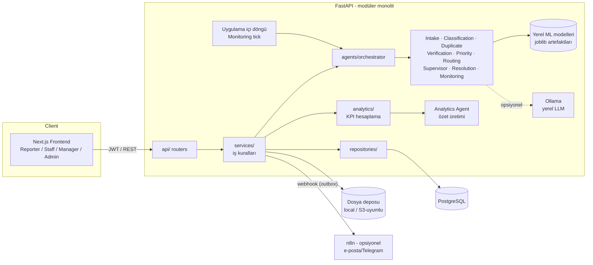
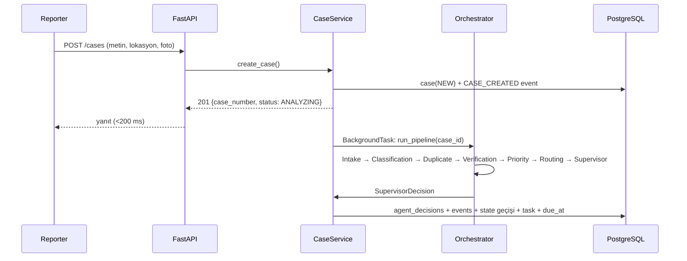

# ARCHITECTURE — CampusFlow AI

## 1. Mimari Yaklaşım

**Modüler monolit.** Tek FastAPI uygulaması, tek PostgreSQL, tek Next.js uygulaması.
Microservice, Kafka, Kubernetes, Redis, Celery **yok**. Modüller arası sınırlar klasör ve
servis arayüzleriyle korunur; ileride gerekirse ayrıştırılabilir.



## 2. Katmanlar (backend)

| Katman | Sorumluluk | Yapmaması gereken |
|---|---|---|
| `api/` | HTTP, auth dependency, request/response şeması, status code | İş kuralı, SQL |
| `schemas/` | Pydantic DTO'lar (API + agent I/O) | DB erişimi |
| `services/` | İş kuralları, transaction sınırı, state machine, event yazımı | HTTP bilgisi |
| `repositories/` | SQLAlchemy sorguları | İş kuralı |
| `models/` | ORM modelleri | Mantık |
| `agents/` | Agent'lar + orchestrator; saf fonksiyon benzeri, DB'ye **yazmaz** | Doğrudan DB yazımı |
| `analytics/` | KPI sorguları ve hesaplamaları | LLM çağrısı |
| `core/` | Config, security, logging, sabitler, hata tipleri | — |

**Kural:** Agent'lar karar **önerir** (Pydantic çıktı). Kararı uygulayan, state geçişini yapan ve
event/decision kaydını yazan tek yer `services/` katmanıdır. Bu sayede agent'lar DB'siz unit test edilir.

## 3. Önerilen Repository Ağacı

```
campusflow/
├── .github/workflows/
│   ├── ci.yml                 # PR: lint + test (backend, frontend, ai)
│   ├── deploy-staging.yml     # develop merge
│   └── deploy-production.yml  # main merge (manuel onay)
├── backend/
│   ├── app/
│   │   ├── main.py
│   │   ├── api/v1/            # auth, cases, tasks, analytics, agents, admin, internal
│   │   ├── core/              # config.py, security.py, constants.py, errors.py, logging.py
│   │   ├── models/            # SQLAlchemy modelleri
│   │   ├── schemas/           # Pydantic şemaları
│   │   ├── repositories/
│   │   ├── services/          # case_service, task_service, workflow, sla_service, ...
│   │   ├── agents/
│   │   │   ├── base.py        # BaseAgent, AgentResult
│   │   │   ├── orchestrator.py
│   │   │   ├── intake.py, classification.py, duplicate.py, verification.py
│   │   │   ├── priority.py, routing.py, supervisor.py
│   │   │   ├── monitoring.py, resolution.py, analytics_summary.py
│   │   │   └── providers/     # classifier.py, embedder.py, llm.py (Protocol + impl.)
│   │   ├── analytics/
│   │   └── storage/           # local / s3 adapter
│   ├── alembic/
│   ├── seeds/                 # idempotent seed (campus template + demo data)
│   ├── tests/{unit,integration}
│   ├── pyproject.toml
│   └── Dockerfile
├── ai/                        # model eğitimi (backend'den bağımsız)
│   ├── data/                  # raw/ (gitignore), synthetic/, labeled/ (anonim)
│   ├── generators/            # sentetik Türkçe bildirim üretici
│   ├── training/              # train_classifier.py, evaluate.py
│   ├── notebooks/             # EDA + akademik raporlama
│   ├── models/                # eğitilmiş .joblib + metrics.json (versiyonlu)
│   └── pyproject.toml
├── frontend/
│   ├── src/app/               # (auth)/login, report, my-cases, cases/[id], staff/..., manager/..., admin/...
│   ├── src/components/        # ui/ (shadcn), charts/, cases/, layout/
│   ├── src/lib/               # api client, auth, types (OpenAPI'den üretilir)
│   ├── tests/  e2e/
│   └── Dockerfile
├── docs/
├── scripts/                   # dev.ps1/dev.sh, gen-api-types, train-and-export
├── docker-compose.yml
├── .env.example
└── README.md
```

## 4. Genellenebilirlik (template yaklaşımı)

Core kavramlar sektörden bağımsızdır: `Organization, Location, Department, CaseType, Case, Task,
SLARule, User, AgentDecision, CaseEvent, Attachment, Comment`.

- `organizations.template_code` = `campus` (ileride `municipality`, `factory`, `hospital`, `mall`, `office`).
- Sektöre özgü her şey **veri**dir: case type'lar, departmanlar, lokasyon tipleri, SLA kuralları,
  anahtar kelime sözlükleri, agent policy'leri → `backend/seeds/templates/campus/*.yaml`.
- ML modeli template başına eğitilir: `ai/models/campus/classifier@<versiyon>.joblib`.
- Kodda `if campus:` gibi dallanma **yasak**. Diğer template'ler bu projede kodlanmayacak.

## 5. İstek Akışı — Case Oluşturma



Pipeline FastAPI `BackgroundTasks` ile çalışır (tüm modeller yerel, toplam < 1 sn hedef).
`ANALYZING` durumunda 5 dk'dan uzun kalan case'leri Monitoring tick yeniden kuyruğa alır (hata toleransı).

## 6. Zamanlanmış İşler

- **Uygulama içi asyncio döngüsü** (FastAPI lifespan), Monitoring Agent'ı 5 dakikada bir çalıştırır (`MONITORING_INTERVAL_SECONDS`). Birden fazla sunucuda turu Postgres advisory lock alan tek sunucu yapar. APScheduler planlanmıştı; tek periyodik iş için bağımlılık eklemeye gerek görülmedi (ADR-8).
- Çoklu instance durumunda çift çalışmayı `pg_try_advisory_lock` engeller.
- Ücretsiz hosting'te uygulama uyuyabildiği için SLA durumu **okuma anında da** hesaplanır
  (`due_at` ile şimdiki zaman karşılaştırması); scheduler sadece event/bildirim üretir.
  Yedek olarak GitHub Actions cron `POST /internal/monitoring/run` (secret header) çağırabilir.

## 7. Bildirimler ve n8n

- Uygulama içi bildirimler `notifications` tablosunda.
- Dış kanallar için **outbox pattern**: `notifications.channel = WEBHOOK` kayıtları, n8n webhook'una
  gönderilir. n8n kapalıysa core sistem etkilenmez.
- n8n'de yalnızca: e-posta, Telegram, haftalık rapor e-postası. Orkestrasyon/SLA/analitik **backend'de**.

## 8. Mimari Kararlar (ADR özeti)

| # | Karar | Gerekçe |
|---|---|---|
| ADR-1 | Modüler monolit | 3 kişi, 12 hafta; operasyonel yük minimum |
| ADR-2 | Ücretli LLM API yok; kural + klasik ML + opsiyonel yerel LLM | Maliyet 0, deterministik, açıklanabilir, test edilebilir, çevrimdışı çalışır |
| ADR-3 | Agent'lar DB'ye yazmaz, servisler yazar | Test edilebilirlik, tek transaction sınırı |
| ADR-4 | Supervisor kararı deterministik politika tablosu | Denetlenebilirlik; "neden otomatik atandı?" sorusuna kesin cevap |
| ADR-5 | Event log birincil kaynak, `cases` üzerindeki zaman damgaları türetilmiş | Process mining ve KPI tutarlılığı |
| ADR-6 | Tek rol / kullanıcı (enum) | RBAC basit ve test edilebilir; çoklu rol gerekmiyor |
| ADR-7 | Frontend tipleri OpenAPI şemasından üretilir | FE/BE sözleşme uyumsuzluğunu önler |
| ADR-8 | Celery/Redis yerine BackgroundTasks + uygulama içi periyodik döngü (E5-10; APScheduler bile gerekmedi) | İhtiyaç kanıtlanmadan altyapı eklenmez |
| ADR-9 | Mobil uygulama yerine PWA (Next `app/manifest.ts` + simgeler); v1'de service worker yok | Tek kod tabanı, mağaza yok. Veri anlık olmalı ve oturum bilgisi önbelleğe girmemeli; MSW'nin service worker'ıyla çakışma riski yok. Telefona kurulum HTTPS ister (staging). Push bildirimleri ileride backend ile birlikte, service worker o zaman eklenir |

## 9. Güvenlik Özeti

- Parola: `argon2` (passlib/argon2-cffi). JWT access token (30 dk) + refresh token (httpOnly cookie).
- RBAC: route dependency `require_roles(...)`; **ownership** kontrolü servis katmanında
  (IDOR: reporter yalnız kendi case'ini, staff yalnız kendine atanmış task'ı görür).
- Upload: MIME sniffing (magic bytes), uzantı whitelist (jpg/png/webp), 10 MB limit, tür başına 5 dosya (bildirim / kanıt), rastgele dosya adı, EXIF temizleme.
- CORS: env'den whitelist. Loglarda parola/token/kişisel veri yok. `audit_logs` admin işlemleri için.
- Rate limit (opsiyonel): `slowapi` ile login ve case oluşturma.
