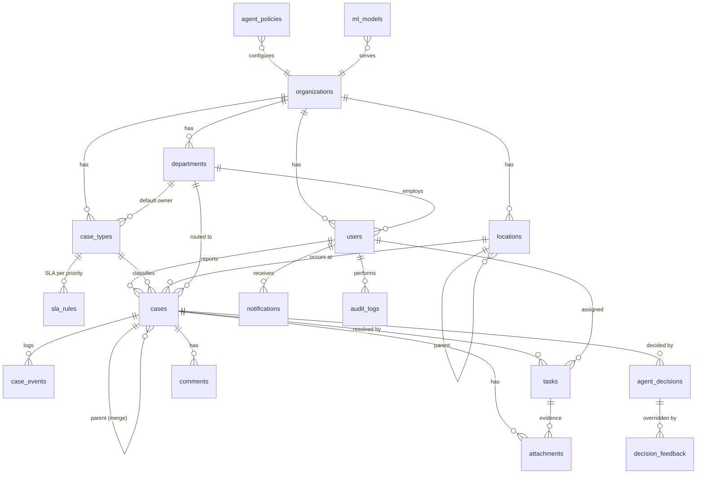

# DATABASE — CampusFlow AI

PostgreSQL 16. Şema yalnızca **Alembic migration** ile değişir. Tüm PK'lar `BIGINT IDENTITY`
(dışarıya açılan referanslar için `case_number`). Zaman damgaları `TIMESTAMPTZ` (UTC saklanır,
UI'da Europe/Istanbul gösterilir). Çok kiracılığa hazırlık için ana tablolarda `organization_id` bulunur.

## 1. ER Diyagramı

## 2. Enum'lar

| Enum | Değerler |
|---|---|
| `user_role` | REPORTER, STAFF, MANAGER, ADMIN |
| `reporter_kind` | STUDENT, ACADEMIC, PERSONNEL |
| `location_kind` | CAMPUS, BUILDING, FLOOR, ROOM, WC, CORRIDOR, OUTDOOR, OTHER |
| `case_category` | CLEANING, CONSUMABLE, TECHNICAL, IT, INFRASTRUCTURE, SECURITY, OTHER |
| `priority` | LOW, MEDIUM, HIGH, CRITICAL |
| `case_status` | NEW, ANALYZING, NEEDS_INFO, CLASSIFIED, ASSIGNED, ACCEPTED, IN_PROGRESS, RESOLVED, VERIFICATION, CLOSED, REOPENED, ESCALATED, REJECTED, MERGED |
| `task_status` | PENDING, ACCEPTED, IN_PROGRESS, COMPLETED, DECLINED, CANCELLED |
| `actor_type` | USER, AGENT, SYSTEM |
| `autonomy_level` | L1_AUTONOMOUS, L2_NOTIFY, L3_ESCALATE |

> `NEEDS_INFO` ve `MERGED` prompt'taki listeye **eklenmiştir**: Supervisor'ın `REQUEST_MORE_INFO` ve
> `MERGE_WITH_EXISTING_CASE` kararlarının karşılığı olan durumlar gerekiyordu (bkz. WORKFLOW.md).

## 3. Tablolar

### organizations
| Kolon | Tip | Not |
|---|---|---|
| id | bigint PK | |
| name | varchar(200) | |
| template_code | varchar(30) | `campus` |
| timezone | varchar(50) | `Europe/Istanbul` |
| created_at | timestamptz | |

### departments
id, organization_id FK, code (uniq/org, ör. `CLEANING`), name, is_active, created_at

### locations
| Kolon | Tip | Not |
|---|---|---|
| id | bigint PK | |
| organization_id | FK | |
| parent_id | FK locations NULL | hiyerarşi: Kampüs → Bina → Kat → Alan |
| kind | location_kind | |
| code | varchar(50) | `B-2-WCM` (org içinde unique) |
| name | varchar(200) | "B Blok 2. Kat Erkek WC" |
| path | varchar(500) | materialized path `KMP/B/B-2/B-2-WCM` (bina/kat analizi için `LIKE 'KMP/B/%'`) |
| importance_weight | smallint | 0–100, Priority Agent sinyali (amfi, laboratuvar > depo) |
| aliases | jsonb | Intake eşleştirmesi: `["b blok erkek tuvalet", "b2 wc"]` |
| is_active | bool | |

### users
id, organization_id, email (uniq), password_hash, full_name, role `user_role`, reporter_kind NULL,
department_id NULL (STAFF/MANAGER için), is_active, last_login_at, created_at

### case_types
| Kolon | Tip | Not |
|---|---|---|
| id, organization_id | | |
| code | varchar(50) | SOAP_EMPTY … OTHER |
| name | varchar(100) | "Sabun Bitti" |
| category | case_category | |
| default_department_id | FK | Routing Agent |
| base_priority | priority | Priority Agent başlangıç sinyali |
| base_severity | smallint | 0–100 |
| is_safety_related | bool | L3 escalation tetikleyicisi |
| keywords | jsonb | Kural tabanlı sınıflandırma sözlüğü |
| is_active | bool | |

### sla_rules
id, organization_id, case_type_id NULL (NULL = kategori/default kural), priority,
response_minutes (kabul hedefi), resolution_minutes, warning_threshold_pct (ör. 75), is_active.
Unique: (organization_id, case_type_id, priority). Eşleşme sırası: tam eşleşme → case_type NULL + priority.

### cases
| Kolon | Tip | Not |
|---|---|---|
| id | bigint PK | |
| organization_id | FK | |
| case_number | varchar(20) uniq | `CASE-000124` (sequence) |
| title | varchar(200) | Kullanıcı girer ya da Intake üretir |
| description | text | |
| reporter_id | FK users | |
| case_type_id | FK NULL | analiz sonrası dolar; manager düzeltebilir |
| category | case_category NULL | case type'tan snapshot (OTHER tipinde kategori ayrı tahmin edilebildiği için tutulur) |
| location_id | FK | |
| department_id | FK NULL | routing sonrası |
| priority | priority NULL | |
| impact_score | smallint NULL | 0–100 (Priority Agent) |
| confidence_score | numeric(4,3) NULL | Classification güveni |
| verification_score | numeric(4,3) NULL | |
| status | case_status | |
| assigned_staff_id | FK users NULL | aktif task'ın atanan kişisi (denormalize) |
| sla_rule_id | FK NULL | |
| parent_case_id | FK cases NULL | MERGED ise ana case |
| duplicate_count | int default 0 | ana case'e bağlanan bildirim sayısı |
| needs_human_review | bool | Manager inceleme kuyruğu |
| escalation_level | smallint default 0 | SLA escalation seviyesi (status'tan bağımsız) |
| created_at, classified_at, assigned_at, accepted_at, started_at, resolved_at, verified_at, closed_at | timestamptz | |
| due_at | timestamptz NULL | SLA çözüm hedefi |
| response_due_at | timestamptz NULL | SLA kabul hedefi |
| reopened_count | int default 0 | |
| satisfaction_rating | smallint NULL | 1–5, reporter geri bildirimi |
| satisfaction_comment | text NULL | |
| is_seed | bool default false | demo verisini ayırt etmek için |

Index'ler: `(organization_id, status)`, `(location_id, case_type_id, created_at)` (recurring + duplicate),
`(department_id, status)`, `(reporter_id, created_at desc)`, `(due_at) WHERE status NOT IN (terminal)`.

### case_events (append-only)
id, case_id, event_type varchar(50), actor_type, actor_id NULL, agent_name NULL,
from_status NULL, to_status NULL, occurred_at, metadata_json jsonb.
Index: `(case_id, occurred_at)`, `(event_type, occurred_at)`. UPDATE/DELETE uygulama katmanında yasak.

### tasks
id, case_id, department_id, assigned_user_id NULL, title, status `task_status`, created_at,
accepted_at, started_at, completed_at, completion_note, declined_reason NULL.
MVP kuralı: bir case'in aynı anda en fazla **1 aktif** task'ı olur (partial unique index).

### agent_decisions
| Kolon | Not |
|---|---|
| id, case_id, run_id (uuid) | aynı pipeline koşusunun kararları gruplanır |
| agent_name | `classification`, `priority`… |
| decision | kısa karar kodu: `SOAP_EMPTY`, `AUTO_ASSIGN`… |
| confidence | numeric(4,3) NULL |
| reason_json | jsonb — yapılandırılmış gerekçe (sinyaller, katkılar, eşleşen kurallar) |
| input_snapshot | jsonb — agent'a verilen girdi (tekrar üretilebilirlik) |
| output_json | jsonb — tam Pydantic çıktısı |
| model | `tfidf-logreg@2026.10.1`, `rules@1.0`, `ollama:qwen2.5:3b` |
| latency_ms | int |
| created_at | |

### decision_feedback
id, decision_id FK, case_id, user_id (manager), field (`case_type`, `priority`, `department`, `duplicate`),
original_value, corrected_value, reason, created_at.
→ *Decision override rate* ve modelin yeniden eğitimi için **etiketli veri kaynağı**.

### agent_policies
id, organization_id, scope (`CATEGORY`/`CASE_TYPE`), category NULL, case_type_id NULL,
autonomy_level, min_confidence_auto numeric (ör. 0.70), notify_manager bool, is_active.

### ml_models
id, organization_id, name (`classifier`), version, algorithm, metrics_json (accuracy, macro_f1,
confusion matrix), trained_at, dataset_hash, artifact_path, is_active.

### comments
id, case_id, author_id, body, is_internal (staff/manager notu, reporter görmez), created_at

### attachments
id, case_id, task_id NULL, uploaded_by, kind (`REPORT`/`EVIDENCE`), storage_key, original_name,
mime_type, size_bytes, sha256, created_at

### notifications
id, user_id NULL, channel (`IN_APP`/`WEBHOOK`), type, payload jsonb, status (`PENDING`/`SENT`/`FAILED`),
read_at, created_at, sent_at

### audit_logs
id, organization_id, user_id, action (`USER_CREATED`, `SLA_UPDATED`…), entity_type, entity_id,
before_json, after_json, ip_address, created_at

## 4. Veri Bütünlüğü Kuralları

- `case_events` ve `agent_decisions` append-only.
- Status değişikliği yalnızca `WorkflowService.transition()` üzerinden; aynı transaction'da event yazılır.
- Migration'lar geri alınabilir (`downgrade`) yazılır; veri silen migration kullanıcı onayı olmadan çalıştırılmaz.
- Seed idempotent: doğal anahtarlarla (`code`, `email`) upsert; demo case'leri `is_seed=true` ile işaretli
  ve sabit random seed ile üretilir.
