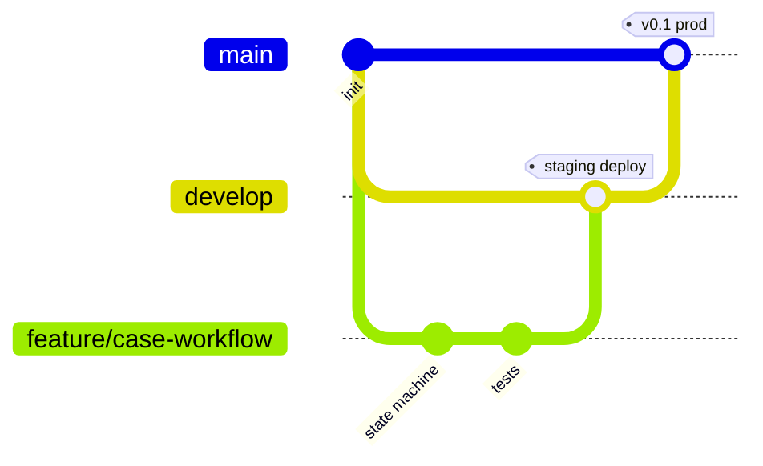

# DEPLOYMENT — Ortamlar, Git Workflow, CI/CD

## 1. Ortamlar

| | LOCAL | STAGING | PRODUCTION |
|---|---|---|---|
| Branch | feature/* | `develop` | `main` |
| Çalıştırma | Docker Compose (frontend, backend, postgres) | Otomatik deploy (develop merge) | Deploy (main merge + manuel onay) |
| Veritabanı | Lokal container | Ayrı DB (demo/seed verisi) | Ayrı DB (seed: yalnız template, demo verisi yok ya da ayrıca kararlaştırılır) |
| AI | `AI_MODE=ml`, Ollama opsiyonel | `AI_MODE=ml`, `LLM_PROVIDER=none` | aynı |
| Dosya | `./storage` volume | S3-uyumlu (ör. Supabase Storage) bucket `staging` | ayrı bucket |

**Ücretsiz barındırma önerisi (FAZ 1'de kesinleşir):** Frontend → Vercel Hobby; Backend → Render/Fly.io
free (Docker); PostgreSQL → Neon (staging ve production **ayrı proje/DB**). Staging ve production aynı
veritabanını **kullanmaz**. Ücretsiz planlarda uygulama uyuyabilir; bu yüzden SLA durumu okuma anında
hesaplanır (bkz. ARCHITECTURE §6).

## 2. Ortam Değişkenleri

`.env.example` repoda, gerçek `.env` dosyaları `.gitignore`'da. Staging/prod değerleri GitHub
Environments secrets ve hosting sağlayıcısının env ayarlarında tutulur.

```
# backend
ENVIRONMENT=local                # local|staging|production
DATABASE_URL=postgresql+psycopg://campusflow:campusflow@db:5432/campusflow
JWT_SECRET=change-me
JWT_ACCESS_TTL_MIN=30
JWT_REFRESH_TTL_DAYS=7
CORS_ORIGINS=http://localhost:3000
STORAGE_BACKEND=local            # local|s3
STORAGE_LOCAL_PATH=/app/storage
STORAGE_BUCKET=
STORAGE_ENDPOINT=
STORAGE_KEY=
STORAGE_SECRET=
MAX_UPLOAD_MB=5
AI_MODE=ml                       # rules|ml|ml_llm
CLASSIFIER_MODEL_PATH=/app/models/campus/classifier.joblib
EMBEDDINGS_ENABLED=false
LLM_PROVIDER=none                # none|ollama
OLLAMA_URL=http://host.docker.internal:11434
OLLAMA_MODEL=qwen2.5:3b
INTERNAL_API_TOKEN=change-me
N8N_WEBHOOK_URL=
SCHEDULER_ENABLED=true
# frontend
NEXT_PUBLIC_API_URL=http://localhost:8000/api/v1
```

> Not: Prompt'taki `AI_API_KEY` ücretli API kullanılmadığı için **gerekmez**; yerine yukarıdaki yerel AI ayarları var.

## 3. Git Workflow



- Branch'ler: `main` (production), `develop` (staging), `feature/<kısa-ad>`, `fix/<kısa-ad>`, `chore/<kısa-ad>`.
- `main` ve `develop` **protected**: direkt push yok, PR + ≥1 onay + yeşil CI zorunlu, squash merge.
- Akış: feature → PR `develop` → CI → staging deploy → ekip testi → PR `develop → main` → production deploy.
- Commit formatı: Conventional Commits (`feat(cases): add transition table`, `fix:`, `test:`, `docs:`, `chore:`).
- PR şablonu: amaç, değişiklik, test kanıtı, ekran görüntüsü (UI), doküman güncellendi mi, migration var mı.
- Kritik PR'lar (workflow, auth, agents, migration) çapraz review: yazan dışında farklı sorumluluk alanından biri.
- Sürüm etiketi: her production release `vX.Y.Z` tag.

## 4. CI/CD (GitHub Actions)

**`ci.yml` — her PR'da (develop/main hedefli):**
| Job | Adımlar |
|---|---|
| backend | `ruff check`, `ruff format --check`, `mypy app`, `pytest` (Postgres service container), `alembic upgrade head` doğrulama |
| ai | `ruff`, `pytest` (generator + agent unit testleri), küçük veriyle eğitim smoke testi |
| frontend | `npm ci`, `eslint`, `tsc --noEmit`, `vitest run`, `next build` |
| e2e (develop→main PR'da) | docker compose up + seed + Playwright kritik senaryo |

**`deploy-staging.yml`:** `develop` push → image build → migration → deploy → smoke (`/health`).
**`deploy-production.yml`:** `main` push → GitHub Environment `production` (manuel onay) → migration → deploy → smoke.

Migration kuralı: veri silen/destructive migration production'a ekip onayı olmadan çıkmaz; önce staging'de test edilir.

## 5. Yerel Geliştirme (FAZ 1'de uygulanacak)

```bash
docker compose up --build
docker compose exec backend alembic upgrade head
docker compose exec backend python -m seeds.run --demo
```

> ⚠️ Proje klasörü şu an **OneDrive** altında. `node_modules`, `.venv` ve Postgres volume'ları OneDrive
> senkronizasyonunda ciddi yavaşlık ve dosya kilidi hatalarına yol açar. Repo'yu `C:\dev\campusflow`
> gibi senkronize olmayan bir klasöre klonlamanız önerilir.
