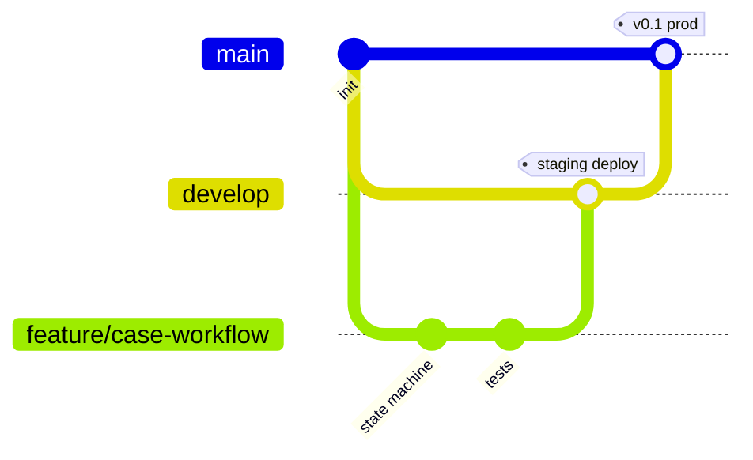

# DEPLOYMENT — Ortamlar, Git Workflow, CI/CD

## 1. Ortamlar

| | LOCAL | STAGING | PRODUCTION |
|---|---|---|---|
| Branch | feature/* | `develop` | `main` |
| Çalıştırma | Docker Compose (frontend, backend, postgres) | Otomatik deploy (develop merge) — Vercel + Render + Neon | Deploy (main merge + manuel onay) — Vercel + Render + Neon |
| Veritabanı | Lokal container | Ayrı DB (demo/seed verisi) | Ayrı DB (seed: yalnız template, demo verisi yok ya da ayrıca kararlaştırılır) |
| AI | `AI_MODE=ml`, Ollama opsiyonel | `AI_MODE=ml`, `LLM_PROVIDER=none` | aynı |
| Dosya | `./storage` volume | S3-uyumlu (ör. Supabase Storage) bucket `staging` | ayrı bucket |

### 1.1 Barındırma kararı ve zamanlama

**Karar (FAZ 1 sonrası):** Frontend → **Vercel** (Hobby) · Backend → **Render** (ücretsiz web service, Docker) ·
PostgreSQL → **Neon** (ücretsiz). Staging ve production **ayrı Neon projesi/DB** kullanır; aynı veritabanını
paylaşmaz. Render'ın kendi ücretsiz Postgres'i süreli olduğu için veritabanı Neon'da tutulur.

**Zamanlama:** Staging, planda son haftalara bırakılmaz; **FAZ 3 ile birlikte (hafta 4–5)** kurulur (backlog E7-3a).
Gerekçe: env/CORS/migration sorunlarını erken görmek ve danışmana her an açılabilir bir demo linki sunmak.
Production (E7-3) hafta 11'de, staging birkaç hafta sorunsuz çalıştıktan sonra açılır.

| | Staging | Production |
|---|---|---|
| Tetikleyici | `develop`'a merge | `main`'e merge + GitHub Environment `production` manuel onayı |
| Frontend | Vercel projesi `campusflow-staging` (production branch: `develop`) | Ayrı Vercel projesi (production branch: `main`) |
| Backend | Render servisi `campusflow-api-staging` | Render servisi `campusflow-api` |
| Veritabanı | Neon projesi `campusflow-staging` | Neon projesi `campusflow-prod` |
| Veri | Demo seed | Yalnız template seed |

**Ücretsiz plan kısıtları ve karşılıkları** (koşullar değişebilir; kurulum günü sağlayıcıların güncel limitleri kontrol edilir):

| Kısıt | Etki | Karşılık |
|---|---|---|
| Render boştayken uyur | İlk istek 30–60 sn sürer; in-process scheduler durur | SLA durumu okuma anında hesaplanır (ARCHITECTURE §6); gerekirse GitHub Actions cron `POST /internal/monitoring/run`; **sunumdan önce servis bir kez açılıp uyandırılır** |
| RAM ~512 MB | Büyük modeller sığmaz | TF-IDF + LogisticRegression yeterli; `EMBEDDINGS_ENABLED=false` |
| Yerel LLM yok | Ollama canlıda çalışmaz | `LLM_PROVIDER=none` ile tam çalışır (ADR-2) |
| Kalıcı disk yok | Yüklenen fotoğraflar yeniden başlatmada kaybolur | `STORAGE_BACKEND=s3` (S3-uyumlu bucket, ör. Supabase Storage) |

**Kurulum adımları (E7-3a, 04.10.2026'da uygulandı):**

1. *(Bahadır)* Vercel, Render ve Neon hesaplarını GitHub ile açar; repoya erişim verir. Hesap açma ve giriş
   işlemleri kişinin kendisi tarafından yapılır.
2. **İmaj:** `backend/Dockerfile` tek imaj. Yerelde docker-compose kendi komutunu (`--reload`) verir; Render
   Dockerfile'daki `CMD` ile başlar: önce `alembic upgrade head` (ücretsiz planda deploy öncesi komut yok;
   migration idempotent), sonra uvicorn Render'ın `PORT` değişkeninde, `--proxy-headers` ile (https → Secure çerez).
   Ayrı `deploy-staging.yml` gerekmez: Render ve Vercel GitHub entegrasyonuyla `develop`'a her merge'de kendileri deploy eder.
3. **Neon:** proje `campusflow-staging`, bölge **AWS Europe Central 1 (Frankfurt)**. Bağlantı adresi Neon'un verdiği
   gibi (`postgresql://…?sslmode=require`) Render'a `DATABASE_URL` olarak yapıştırılır; uygulama psycopg sürücüsünü
   kendisi ekler (`core/config.py`).
4. **Render Web Service:** repo `BITIRME_PROJESI`, branch `develop`, Root Directory `backend`, Runtime **Docker**,
   Region **Frankfurt**, Instance **Free**, Health Check Path `/api/v1/health`, Auto-Deploy açık. Ad:
   `campusflow-api-staging`. Env:

   | Değişken | Değer |
   |---|---|
   | `ENVIRONMENT` | `staging` |
   | `DATABASE_URL` | Neon bağlantı adresi (secret) |
   | `JWT_SECRET` | Render'ın **Generate** düğmesiyle rastgele (secret) |
   | `CORS_ORIGINS` | Vercel staging adresi (rewrite ile gerekmez; doğrudan erişim için) |

5. **Vercel:** repo, Root Directory `frontend`, **Production Branch = `develop`** (bu proje staging'dir; production
   için ayrı Vercel projesi `main`'i izler). Env:

   | Değişken | Değer |
   |---|---|
   | `BACKEND_ORIGIN` | Render servisinin adresi, sonunda `/` olmadan (ör. `https://campusflow-api-staging.onrender.com`) |
   | `NEXT_PUBLIC_API_URL` | `/api/v1` |
   | `NEXT_PUBLIC_API_MOCKING` | `disabled` |

   **Neden doğrudan Render adresi değil:** giriş çerezi `SameSite=Strict`; Vercel ve Render farklı siteler olduğu için
   tarayıcı çerezi göndermez, oturum yenilenemez. `frontend/next.config.ts` `/api/v1/*` isteklerini
   `BACKEND_ORIGIN`'e aktarır; tarayıcı tek site görür. Yerelde `next start` ile doğrulandı: giriş çerezi frontend
   adresinden geldi, `/auth/refresh` 200 döndü.
6. **Demo verisi (tek seferlik):** kendi terminalinizde, Neon adresini komuta yazarak (sohbete/repoya yapıştırmadan):

   ```bash
   docker compose run --rm -e ENVIRONMENT=staging -e DATABASE_URL="<Neon adresi>" -e JWT_SECRET="<32+ karakter rastgele>" -e SEED_DEMO_PASSWORD="<yeni parola>" backend sh -c "alembic upgrade head && python -m seeds.run --demo --history"
   ```

   ⚠️ `SEED_DEMO_PASSWORD` için `.env.example`'daki yerel değeri **kullanmayın**: o değer public repoda yazılı, staging
   ise internete açık; demo admin hesabını herkes açabilir. Staging parolası yalnız ekipte paylaşılır.
7. **Bilinen kısıt:** `STORAGE_BACKEND=local`; Render diski kalıcı değil, yüklenen fotoğraflar her deploy/yeniden
   başlatmada silinir. Staging için kabul edildi; production öncesi S3-uyumlu depo (E7-3).
8. Secret'lar yalnız sağlayıcıların env ayarlarında tutulur; repoya ve sohbete yazılmaz.

## 2. Ortam Değişkenleri

`.env.example` repoda, gerçek `.env` dosyaları `.gitignore`'da. Staging/prod değerleri GitHub
Environments secrets ve hosting sağlayıcısının env ayarlarında tutulur.

```
# backend
ENVIRONMENT=local                # local|staging|production
DATABASE_URL=postgresql+psycopg://campusflow:campusflow@db:5432/campusflow
JWT_SECRET=change-me
JWT_ACCESS_TTL_MIN=30
JWT_REFRESH_TTL_DAYS=7
SEED_DEMO_PASSWORD=                # yalniz seeds.run --demo; production'da --demo reddedilir
CORS_ORIGINS=http://localhost:3000
STORAGE_BACKEND=local            # local|s3
STORAGE_LOCAL_PATH=/app/storage
STORAGE_BUCKET=
STORAGE_ENDPOINT=
STORAGE_KEY=
STORAGE_SECRET=
MAX_UPLOAD_MB=10                 # fotograf (telefon fotografi 4-8 MB)
MAX_VIDEO_MB=50                  # 30 sn video
AGENTS_ENABLED=true              # false: agent hatti kapali, bildirim manager'i bekler (acil durum anahtari)
MONITORING_ENABLED=true          # Monitoring Agent: uygulama icinde periyodik tur (SLA, takilan bildirimler)
MONITORING_INTERVAL_SECONDS=300  # tur araligi; birden fazla sunucuda turu advisory lock alan tek sunucu yapar
AI_MODE=ml                       # rules|ml|ml_llm
CLASSIFIER_MODEL_PATH=/app/models/campus/classifier.joblib
EMBEDDINGS_ENABLED=false
LLM_PROVIDER=none                # none|ollama
OLLAMA_URL=http://host.docker.internal:11434
OLLAMA_MODEL=qwen2.5:3b
INTERNAL_API_TOKEN=change-me
N8N_WEBHOOK_URL=
SCHEDULER_ENABLED=true
# frontend
NEXT_PUBLIC_API_URL=http://localhost:8000/api/v1
```

> Not: Prompt'taki `AI_API_KEY` ücretli API kullanılmadığı için **gerekmez**; yerine yukarıdaki yerel AI ayarları var.

## 3. Git Workflow



- Branch'ler: `main` (production), `develop` (staging), `feature/<kısa-ad>`, `fix/<kısa-ad>`, `chore/<kısa-ad>`.
- Branch koruması iki ruleset ile yapılır:

| | `protect-develop` (staging) | `protect-main` (production) |
|---|---|---|
| Direkt push | ❌ (PR zorunlu) | ❌ (PR zorunlu) |
| Onay | **Gerekmez** — PR sahibi CI yeşilse kendisi merge eder | **1 onay, Code Owner (@bahadirgokturk)** |
| Silme / force push | ❌ | ❌ |
| Merge yöntemi | Squash | Merge commit (develop geçmişi korunur) |
| Bypass | Yok | Repository admin — *For pull requests only* (sahip kendi release PR'ını onaylayamadığı için) |

- Gerekçe: `develop` test ortamıdır; hız önemli, güvenceyi CI sağlar. Canlıya geçiş (`develop → main`) tek
  kontrollü kapıdır ve proje sahibinin onayını ister.
- PR'lara ekip üyelerinin yorum bırakması teşvik edilir (bilgi paylaşımı), ama `develop` için zorunlu değildir.
- Akış: feature → PR `develop` → CI → staging deploy → ekip testi → PR `develop → main` → production deploy.
- Commit formatı: Conventional Commits (`feat(cases): add transition table`, `fix:`, `test:`, `docs:`, `chore:`).
- PR şablonu: amaç, değişiklik, test kanıtı, ekran görüntüsü (UI), doküman güncellendi mi, migration var mı.
- Kritik PR'lar (workflow, auth, agents, migration) merge'den önce farklı sorumluluk alanından bir ekip üyesine gösterilir.
- Sürüm etiketi: her production release `vX.Y.Z` tag.

## 4. CI/CD (GitHub Actions)

**`ci.yml` — her PR'da (develop/main hedefli):**
| Job | Adımlar |
|---|---|
| backend | `ruff check`, `ruff format --check`, `mypy app`, `pytest` (Postgres service container), `alembic upgrade head` doğrulama |
| ai | `ruff`, `pytest` (generator + agent unit testleri), küçük veriyle eğitim smoke testi |
| frontend | `npm ci`, `eslint`, `tsc --noEmit`, `vitest run`, `next build` |
| e2e (develop→main PR'da) | docker compose up + seed + Playwright kritik senaryo |

**`deploy-staging.yml`:** `develop` push → image build → migration → deploy → smoke (`/health`).
**`deploy-production.yml`:** `main` push → GitHub Environment `production` (manuel onay) → migration → deploy → smoke.

Migration kuralı: veri silen/destructive migration production'a ekip onayı olmadan çıkmaz; önce staging'de test edilir.

## 5. Yerel Geliştirme

```bash
cp .env.example .env
docker compose up --build -d
docker compose exec backend alembic upgrade head
cd frontend && npm ci && npm run dev
```

| Servis | Adres | Not |
|---|---|---|
| frontend | http://localhost:3000 | **Docker dışında** `npm run dev`. Windows/macOS bind mount'larında Turbopack dosya değişikliklerini alamıyor; Next.js dokümanı da geliştirmede Docker'sız çalışmayı öneriyor. Varsayılan env: `frontend/.env.development` |
| backend | http://localhost:8000/docs | `uvicorn --reload`; sağlık: `/api/v1/health` (DB yoksa 503) |
| db | localhost:5433 | PostgreSQL 16, `pgdata` volume. Her geliştiricinin **kendi** DB'si vardır; ortak DB yoktur. Host portu `POSTGRES_HOST_PORT` ile değişir (kurulu bir PostgreSQL 5432'yi kullandığı için 5433) |

- Backend testleri konteynerde: `docker compose exec backend pytest`. Integration testleri geliştirme
  DB'sine dokunmaz; aynı sunucuda `<db>_test` veritabanını oluşturup kullanır.
- Seed: `docker compose exec backend python -m seeds.run --demo` (kampüs şablonu + demo kullanıcıları,
  tekrar çalıştırmak güvenli). Ayrıntı ve demo hesapları: [backend/seeds/README.md](../backend/seeds/README.md).
  `--demo` production'da reddedilir; staging'de `SEED_DEMO_PASSWORD` Render panelinden verilir.
- Backend Dockerfile'ı şimdilik geliştirme imajıdır; backend ve frontend production imajları staging kurulumunda (E7-3a) yazılır.

> ⚠️ Repo **OneDrive/Dropbox** altında olmamalı: `node_modules` ve Postgres volume'ları senkronizasyonda
> ciddi yavaşlık ve dosya kilidi hatalarına yol açar. `C:\dev\campusflow` gibi bir klasör kullanın.
