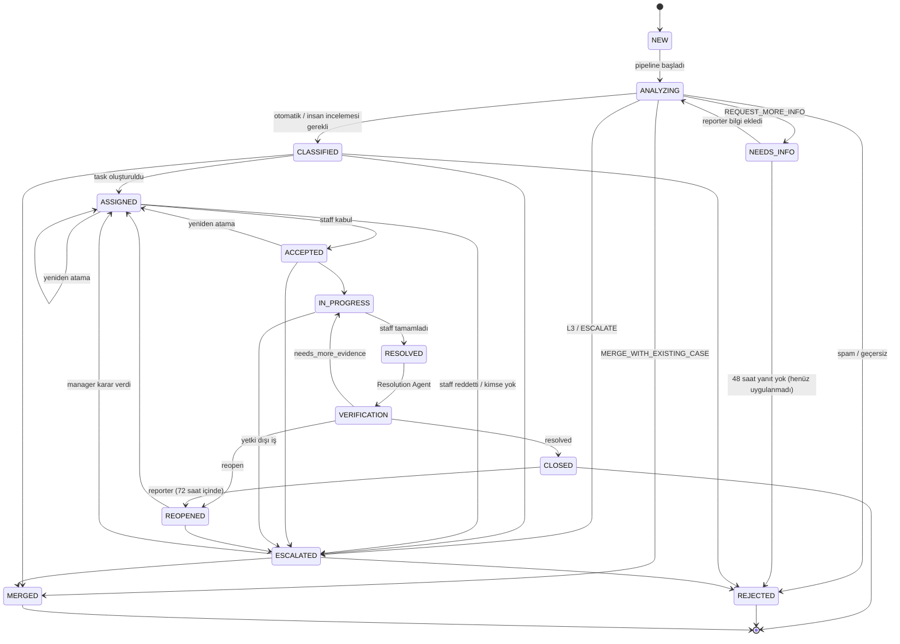

# WORKFLOW — State Machine & RBAC

## 1. Case State Machine



### Kurallar

- Geçişler `backend/app/services/workflow.py` içinde **tek bir tablo** (`ALLOWED_TRANSITIONS: dict[CaseStatus, set[CaseStatus]]`)
  olarak tanımlanır. Tablo dışı geçiş `InvalidTransitionError` → HTTP 409.
- Her geçiş: ilgili zaman damgası (`assigned_at`…) + `case_events` kaydı aynı transaction'da.
- Zaman damgaları **ilk** gerçekleşmede yazılır. İstisna: reopen sonrası `resolved_at` ve `closed_at` güncellenir
  (SLA son çözüme göre ölçülür; reporter'ın 72 saatlik itiraz/puan penceresi son kapanıştan başlar). İlk değerler
  event log'da korunur.
- `ESCALATED` **durumu** = manager karar kuyruğu (atama öncesi risk). SLA gecikmesi escalation'ı ise
  status'u değiştirmez; `escalation_level` artar + `ESCALATED` event yazılır. Böylece devam eden iş bozulmaz.
- Terminal durumlar: `CLOSED` (reopen penceresi hariç), `REJECTED`, `MERGED`.
- `REOPENED` → `reopened_count += 1`.

### Case ↔ Task senkronizasyonu

Uygulama: `backend/app/services/task_service.py`. **Geçici kural (FAZ 5'e kadar):** Resolution Agent yokken
tamamlanan görev doğrulama beklemeden `RESOLVED → VERIFICATION → CLOSED` olur; olaylar `SYSTEM` aktörüyle ve
`metadata.rule = "auto_close_until_resolution_agent"` ile yazılır. Agent'lar yokken manager ataması `ANALYZING`
bildirimi önce `CLASSIFIED` yapar (`ROUTED`, elle yönlendirme). Reddedilen görevde bildirim `ESCALATED` olur
(manager yeniden atar; otomatik yeniden yönlendirme FAZ 5).

| Task olayı | Task status | Case status |
|---|---|---|
| Task oluşturuldu | PENDING | ASSIGNED |
| Staff kabul etti | ACCEPTED | ACCEPTED |
| Staff başladı | IN_PROGRESS | IN_PROGRESS |
| Staff tamamladı | COMPLETED | RESOLVED → (Resolution Agent) VERIFICATION → CLOSED |
| Staff reddetti | DECLINED | ASSIGNED (yeni task) veya ESCALATED |
| Case merge/reject | CANCELLED | MERGED / REJECTED |

## 2. Task State Machine

```
PENDING → ACCEPTED → IN_PROGRESS → COMPLETED
PENDING → DECLINED | CANCELLED
ACCEPTED → DECLINED | CANCELLED
IN_PROGRESS → CANCELLED
```

## 3. Event Tipleri

`CASE_CREATED, ANALYSIS_STARTED, AI_CLASSIFIED, DUPLICATE_CHECKED, VERIFICATION_SCORED,
PRIORITY_CALCULATED, ROUTED, SUPERVISOR_DECIDED, HUMAN_REVIEW_REQUESTED, INFO_REQUESTED, INFO_PROVIDED,
CASE_MERGED, TASK_CREATED, TASK_ACCEPTED, TASK_DECLINED, TASK_REASSIGNED, WORK_STARTED, WORK_COMPLETED,
EVIDENCE_UPLOADED, RESOLUTION_EVALUATED, RESOLUTION_VERIFIED, CASE_CLOSED, CASE_REOPENED, CASE_REJECTED,
SLA_WARNING, SLA_BREACHED, ESCALATED, DECISION_OVERRIDDEN, COMMENT_ADDED, FEEDBACK_SUBMITTED`

`metadata_json` örneği (`PRIORITY_CALCULATED`):
```json
{"decision_id": 812, "priority": "HIGH", "impact_score": 72}
```

## 4. RBAC Matrisi

✅ = izinli · 🔸 = yalnızca sahiplik/kapsam dahilinde · ❌ = yasak

| İşlem | REPORTER | STAFF | MANAGER | ADMIN |
|---|:-:|:-:|:-:|:-:|
| Case oluşturma | ✅ | ✅ | ✅ | ✅ |
| Case görüntüleme | 🔸 kendi | 🔸 kendine atanmış + departmanı | ✅ | ✅ |
| Case'e fotoğraf ekleme | 🔸 kendi | 🔸 atanmış (kanıt) | ✅ | ❌ |
| Public yorum | 🔸 kendi | 🔸 atanmış | ✅ | ❌ |
| Internal yorum görme/yazma | ❌ | 🔸 | ✅ | ❌ |
| Geri bildirim / reopen | 🔸 kendi, kapanıştan 72 sa. | ❌ | ✅ | ❌ |
| Task listeleme | ❌ | 🔸 kendi | ✅ | ✅ (salt okuma) |
| Task kabul/başlat/tamamla/reddet | ❌ | 🔸 kendi | ❌ | ❌ |
| Case (yeniden) atama | ❌ | ❌ | ✅ | ❌ |
| Ek bilgi isteme (`request-info`) | ❌ | ❌ | ✅ | ❌ |
| Ek bilgiyi yanıtlama (`info`) | 🔸 kendi | ❌ | ❌ | ❌ |
| Agent kararını düzeltme (override) | ❌ | ❌ | ✅ | ❌ |
| Human review kuyruğu | ❌ | ❌ | ✅ | ❌ |
| Escalated case kararı | ❌ | ❌ | ✅ | ❌ |
| Case reject/merge (manuel) | ❌ | ❌ | ✅ | ❌ |
| Dashboard / analytics / agent metrikleri | ❌ | ❌ | ✅ | ✅ |
| AI yönetim özeti | ❌ | ❌ | ✅ | ✅ |
| Agent karar geçmişi | ❌ | ❌ | ✅ | ✅ |
| Kullanıcı / departman / lokasyon / case type / SLA / agent policy yönetimi | ❌ | ❌ | ❌ | ✅ |
| Audit log görüntüleme | ❌ | ❌ | ❌ | ✅ |

**Notlar**
- Admin operasyonel karar vermez (görev ayrılığı — YBS iç kontrol ilkesi).
- MANAGER MVP'de tüm organizasyonu görür; departman bazlı kısıt ileride `department_id` ile eklenebilir.
- IDOR koruması: ID ile gelen her kaynak `services/authorization.py` içindeki `can_view_case(user, case)`
  benzeri fonksiyonlardan geçer; erişim yoksa **404** (varlık sızdırılmaz).
